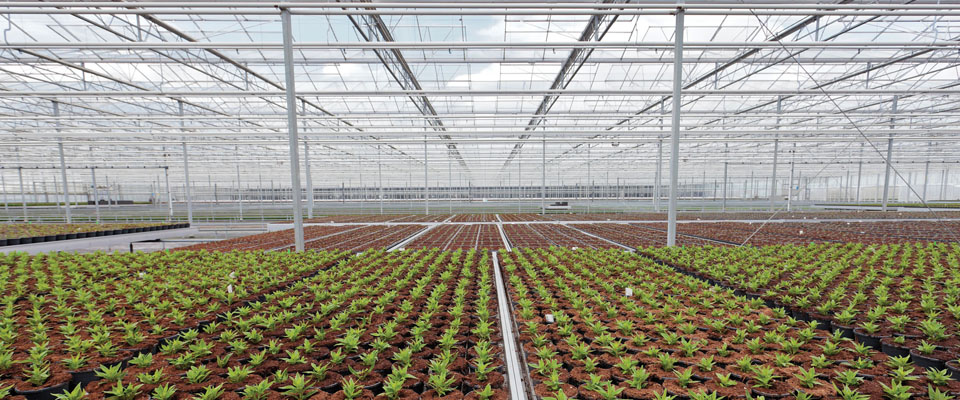
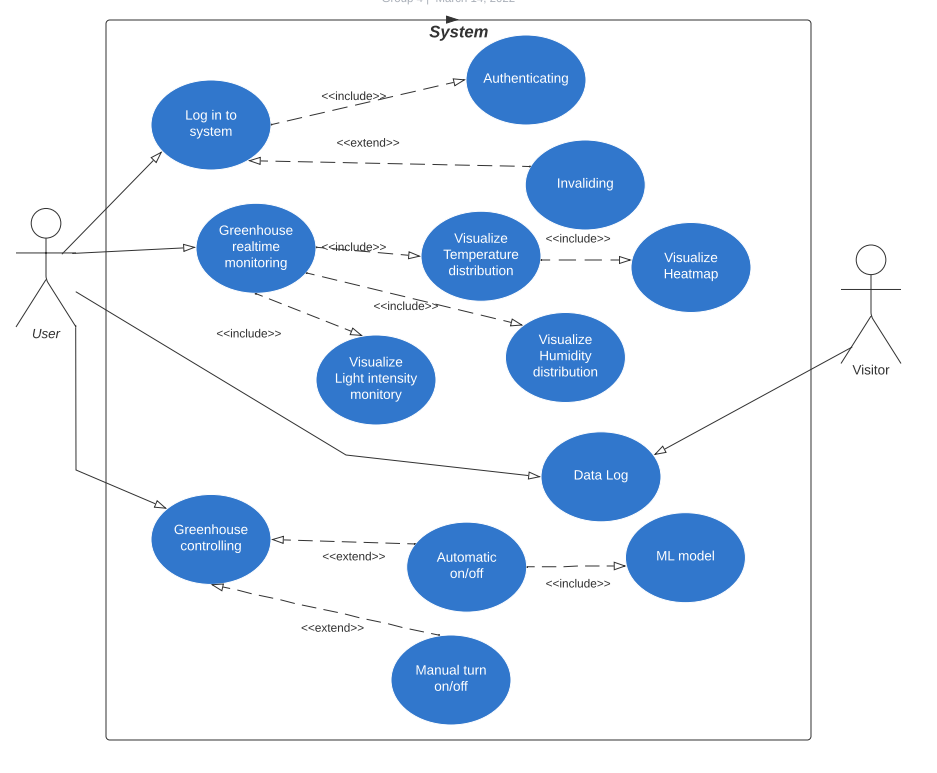

[comment]: # "This is the standard layout for the project, but you can clean this and use your own template"

# Greenhouse monitoring and controlling based on IOT/Sensor data

---

## Team
-  E/17/065, Kanishka dilhan, [email](mailto:17065@eng.pdn.ac.lk)
-  E/17/312, Ishini udara, [email](mailto:17312@eng.pdn.ac.lk)
-  E/17/240, Nadeesha diwakara, [email](mailto:17240@eng.pdn.ac.lk)

## Table of Contents
1. [Introduction](#introduction)
2. [Solution Architecture](#solution-architecture)
3. [UML Diagram](#uml-diagram)
4. [Other Sub Topics](#other-sub-topics)
5. [Links](#links)

---

## Introduction

 In traditional farming, farmer has to visit the farming land regularly to measure the various environmental parameters such as temperature, humidity and light intensity to cultivate the right crops at right time in right soil. Even though this traditional farming system have been used for years, the system is hectic and fail to prove high productivity rate as farmer usually unable to measure all the parameter accurately. In contrast, greenhouse farming is a system where farmer cultivate crops in ecosystem environments where all environmental parameters are adjusted based on crop types. Automation in greenhouse is a method where farmer can monitor and control the greenhouse environment automatically from anywhere in the world any time. Automated greenhouse monitoring and controlling system that incorporate various sensors such as temperature sensor, humidity sensor and light sensor to collect possible environmental parameters of greenhouse. Internet of Things (IoT) is used to store data to a database and process the collected data and finally send the information to the web interface which has been developed for monitoring and controlling of greenhouse by the user.

## Solution Architecture

## UML Diagram

## Other Sub Topics

.....

## Links

- [Project Repository](https://github.com/cepdnaclk/e17-co328-Greenhouse-monitoring-and-controlling-based-on-IOT-sensor-data{{ page.repository-name }}){:target="_blank"}
- [Project Page](https://cepdnaclk.github.io/e17-co328-Greenhouse-monitoring-and-controlling-based-on-IOT-sensor-data{{ page.repository-name}}){:target="_blank"}
- [Department of Computer Engineering](http://www.ce.pdn.ac.lk/)
- [University of Peradeniya](https://eng.pdn.ac.lk/)

[//]: # (Please refer this to learn more about Markdown syntax)
[//]: # (https://github.com/adam-p/markdown-here/wiki/Markdown-Cheatsheet)
